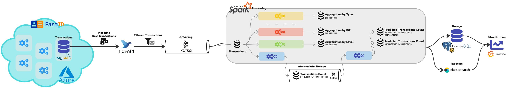

# fastid-report-app

#unict university project for Technologies for Advanced Programming.

FastID is a SaaS that allows companies to build easily solutions that integrate with SPID and CIE authentication.
This project is a pipeline for the FastID service that allows predictive scaling by predicting what will be the traffic in the following 15 minutes.
A "transaction" must be intended as a successfully login recorded by the service and logged in the database.

The pipeline predicts a different count for each customer (=website, or username in the codebase) and implements an **online learning model** that corrects itself as new transactions come in. The dashboard allows to compare the real transactions with the predicted and the predicted after correction ones.

## Architecture

The architecture is the following:

It consists of the following component:
- MySQL: this database contains a table with all the transactions. This is external and is used to log the transactions. It gets filled automatically by FastID.
- Fluentd: allows to pull frequently data from MySQL, allowing to ingest the data in the pipeline writing into a Kafka topic.
- Kafka: stores all the transactions and some intermediate aggregations used by the processing tool.
- Spark: processes the transactions reading from the Kafka topic. It uses Kafka itself to store intermediate aggregations and it writes the final results to Postgres and ElasticSearch.
- ElasticSearch: allows to index the aggregations.
- Postgres: stores the transactions counts.
- Grafana: allows to visualize the data.

To run the solution:
1. Build the images `docker compose build` 
2. Run `docker compose up`
3. Imported the MySQL dump using the below steps. This step is optional if you use the web page (see 6.).
4. Visit `localhost:3000` and login using `admin` `admin`.
5. After the mandatory password change, import the dashboard `json` contained in the `grafana` folder, then open it.
6. Enjoy. You may use the `index.html` in the `login` folder to simulate transactions.

## Source Code

There are two docker compose:
- `docker-compose.yaml`: contains the containers for the pipeline itself
- `dev.docker-compose.yaml`: contains the containers for debugging. In production, this will be external services. It includes MySQL and a Spark Notebook for debugging.

The `login` folder contains an HTML page to test the pipeline by inserting transactions in the pipeline. The page writes directly to fluentd skipping the database. This isn't a container, it's a plain HTML file in the source code, it can be run with the browser directly.

The other folders, which are `mysql`, `fluentd`, `spark-processor`, `postgres` and `grafana`, contain files related to the homonymous containers.

The `mysql` folder contains a `dump` that allows to restore a fraction of the original transactions database with real logins of anonymized users.

### Debug

To listen the Kafka topics:
- Get all new `transactions`: `docker exec -it kafkaServer kafka-console-consumer.sh --topic transactions --bootstrap-server http://kafkaServer:9092 --property print.key=true`
- Get all `customer-transactions-count`: `docker exec -it kafkaServer kafka-console-consumer.sh --topic customer-transactions-count --bootstrap-server http://kafkaServer:9092 --property print.key=true --from-beginning`

To extract the dump into mysql:
1. `docker exec -it fastid-logs-db bash`
2. `cd /sql-dump`
3. `tar -xvzf ./archive/dump.tar.gz -C .`
4. `mysql -u root -h 127.0.0.1 -p`
5. *enter password*
6. `CREATE DATABASE DataCollectorServer`
7. `USE DataCollectorServer; source DataCollectorServer.sql`

